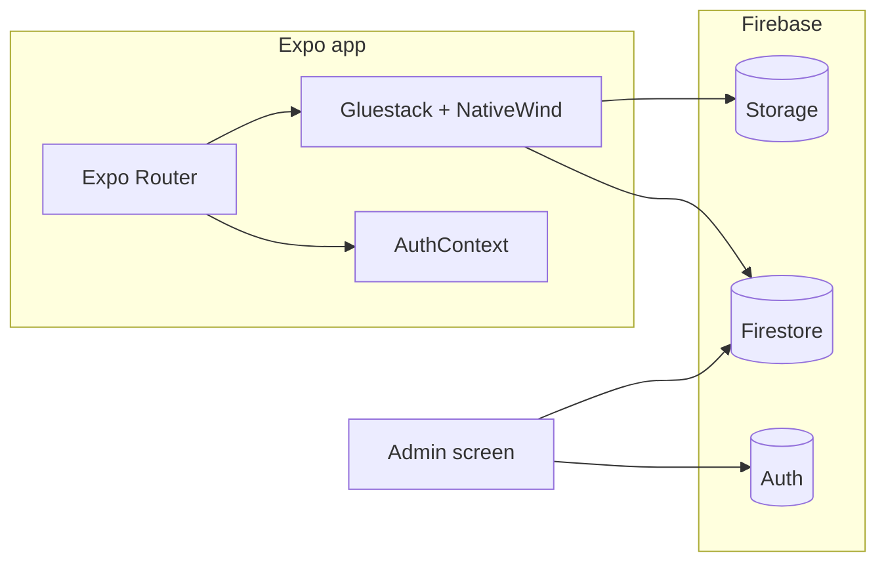

# Mahaprasade Govinde

Cross-platform mobile and web application for discovering **Mahaprasadam** (sanctified prasadam) offered by registered vendors at **railway stations** and **cities**. The app combines a public discovery experience with **vendor sign-in**, a **protected vendor dashboard** for menus and profile, and an **administrative approval** flow backed by **Firebase**.

Built with **Expo SDK 53**, **Expo Router**, **React Native 0.79**, and **Firebase** (Firestore, Storage, Authentication).

---

## Table of contents

- [Features](#features)
- [Tech stack](#tech-stack)
- [Architecture](#architecture)
- [Requirements](#requirements)
- [Getting started](#getting-started)
- [npm scripts](#npm-scripts)
- [Project structure](#project-structure)
- [Data model (Firestore)](#data-model-firestore)
- [Routing](#routing)
- [Native builds (EAS)](#native-builds-eas)
- [Web and Firebase Hosting](#web-and-firebase-hosting)
- [Quality and testing](#quality-and-testing)
- [Security and configuration](#security-and-configuration)
- [Troubleshooting](#troubleshooting)

---

## Features

| Area | Description |
|------|-------------|
| **Station search** | Alphabetical browse and live search over Firestore `stations`; navigation to station detail and linked vendors. |
| **City search** | Same pattern for `cities`, with entry from a dedicated bottom action on the home screen. |
| **Vendor discovery** | Station and city documents maintain a `vendors_list`; only vendors with `isApproved: true` are shown to end users. |
| **Vendor registration** | Sign-up and sign-in on `Login_page` with mobile/password flow, optional profile image (compressed, uploaded to Firebase Storage), and association to station and/or city. |
| **Vendor session** | `AuthContext` persists the signed-in vendor in **AsyncStorage**; returning vendors are routed to their dashboard. |
| **Vendor dashboard** | `vndor_cardlog/[vendor_card_login]` (protected): menu items, profile fields, and image updates via Firestore and Storage. |
| **Admin** | `Admin`: Firebase **email/password** sign-in; Firestore `users/{uid}` must exist with `role: 'admin'`. |
| **Approvals** | `Approval`: lists pending vs approved vendors; toggles `isApproved` on vendor documents. |
| **UI** | **Gluestack UI** components, **NativeWind** / **Tailwind**-style classes, drawer-style **sidebar** for vendor and admin entry points. |
| **Web** | Static export compatible workflow; **Firebase Hosting** rewrites SPA routes to `index.html`. Push notification config is present for web (VAPID in `app.json`). |

---

## Tech stack

- **Runtime:** [Expo](https://expo.dev) ~53, [Expo Router](https://docs.expo.dev/router/introduction/) ~5 (file-based routing, typed routes experiment enabled)
- **UI:** React 19, React Native 0.79, [@gluestack-ui](https://gluestack.io/) primitives, [NativeWind](https://www.nativewind.dev/) v4, [Tailwind CSS](https://tailwindcss.com/) v3
- **Backend / data:** [Firebase](https://firebase.google.com/) JS SDK v11 — Firestore, Storage, Auth (admin flow)
- **Native:** `expo-dev-client`, Reanimated, Gesture Handler, Safe Area, Screens, Image Picker / Manipulator, Notifications (configured)
- **Build / deploy:** [EAS Build](https://docs.expo.dev/build/introduction/) (`eas.json`), Firebase Hosting (`firebase.json`, `deploy-hosting` script)

---

## Architecture

- **Entry:** `expo-router/entry` → `app/_layout.tsx` wraps the tree in `AuthProvider`, `GluestackUIProvider`, and React Navigation `ThemeProvider`, then a root `Stack` of screens.
- **State:** Global vendor session lives in `contexts/AuthContext.js` (AsyncStorage + React context).
- **Guarding:** `components/ProtectedRoute.js` redirects unauthenticated users away from vendor-only screens.
- **Data access:** Screens and components import the shared Firestore/Storage singletons from `app/firebase_config.js`.



---

## Requirements

- **Node.js** LTS (recommended: current Node 20+)
- **npm** (lockfile present; use `npm ci` in CI when appropriate)
- For **Android** push and Google services: `google-services.json` at project root (referenced from `app.json`); obtain from the Firebase Console for your Android app.
- For **iOS** development: Xcode and CocoaPods toolchain (Apple platform only).
- Optional: [EAS CLI](https://docs.expo.dev/eas/) for cloud builds, [Firebase CLI](https://firebase.google.com/docs/cli) for hosting deploy.

---

## Getting started

1. **Clone the repository**

   ```bash
   git clone https://github.com/RohanKaurav/Mahaprasade.git
   cd mahaprasade-govinde-app
   ```

2. **Install dependencies**

   ```bash
npm install
```

3. **Start the development server**

   ```bash
npm start
   ```

   Or run `npx expo start`. Use the Expo Dev Tools to open **iOS simulator**, **Android emulator**, **web**, or a **development build** (this project includes `expo-dev-client`; Expo Go may not satisfy all native modules).

4. **Firebase**

   Point `app/firebase_config.js` at your own Firebase project for local or forked development. The app expects Firestore and Storage rules that allow your intended read/write patterns (tighten rules for production; avoid wide-open rules).

---

## npm scripts

| Script | Purpose |
|--------|---------|
| `npm start` | Start Expo Metro bundler (`expo start`). |
| `npm run android` | Run on Android (`expo run:android`). |
| `npm run ios` | Run on iOS (`expo run:ios`). |
| `npm run web` | Start with web platform (`expo start --web`). |
| `npm test` | Run Jest with `jest-expo` preset (`--watchAll`). |
| `npm run lint` | Run Expo’s ESLint setup (`expo lint`). |
| `npm run predeploy` | Export static web build to `dist` (`expo export -p web`). |
| `npm run deploy-hosting` | Build web then deploy Firebase Hosting (`firebase deploy --only hosting`). |
| `npm run reset-project` | Expo template utility; moves starter example (see `scripts/reset-project.js`). |

---

## Project structure

High-level layout (not exhaustive):

```text
app/                    # Expo Router routes and firebase_config
  _layout.tsx           # Root providers and stack screens
  index.jsx             # Home: vendor redirect or HomeSearch
  firebase_config.js    # Firebase app + db + storage exports
  Login_page.jsx        # Vendor auth / registration
  Admin.jsx             # Admin Firebase Auth gate
  Approval.jsx          # Vendor approval UI
  cities.jsx            # City search listing
  city/[city_id].jsx    # City detail + vendors
  station/[id].jsx      # Station detail + vendors
  vendor/[vendor_id].jsx
  vndor_cardlog/[vendor_card_login].jsx  # Vendor dashboard (route segment spelling as in repo)

components/             # Shared UI (HomeSearch, VendorCard, Sidebar, ProtectedRoute, Gluestack UI kit)
contexts/AuthContext.js
hooks/                  # Theme / color scheme helpers
constants/              # e.g. Colors
assets/                 # Images, fonts
eas.json                # EAS build profiles
firebase.json           # Hosting (dist) + functions config reference
app.json                # Expo app config (name, plugins, web export, EAS project id)
```

Path alias **`@/`** maps to the repository root (see `babel.config.js` and `tsconfig.json`).

---

## Data model (Firestore)

The codebase assumes collections roughly shaped as follows (field names inferred from usage):

| Collection | Role |
|------------|------|
| `stations` | Documents include `name` and `vendors_list` (array of vendor document IDs). |
| `cities` | Same pattern: `name`, `vendors_list`. |
| `vendors` | Vendor profile, `isApproved`, links to station/city, `menu` array, image URLs/paths, credentials as implemented in `Login_page.jsx`. |
| `users` | Document ID = Firebase Auth `uid`; `role: 'admin'` for admin access after `signInWithEmailAndPassword`. |

Indexes and security rules are not committed here; define them in the Firebase Console to match your queries (e.g. `where` clauses if you add them later).

---

## Routing

| Route | Screen |
|-------|--------|
| `/` | Home: loading gate + `HomeSearch` or redirect to vendor log |
| `/station/[id]` | Station detail and approved vendors |
| `/city/[city_id]` | City detail and approved vendors |
| `/vendor/[vendor_id]` | Vendor-facing route (vendor card / detail) |
| `/vndor_cardlog/[vendor_card_login]` | Protected vendor menu and profile |
| `/Login_page` | Vendor login and registration |
| `/cities` | City search |
| `/Admin` | Admin login modal |
| `/Approval` | Admin vendor approval lists |

---

## Native builds (EAS)

`eas.json` defines **development** (dev client, internal distribution, Android APK), **preview** (internal APK), and **production** (auto-increment app version from remote).

```bash
npx eas-cli build --profile development --platform android
```

Replace profile/platform as needed. The Expo project ID is stored under `expo.extra.eas` in `app.json`.

---

## Web and Firebase Hosting

- **Export:** `npm run predeploy` writes a static site to **`dist/`** (see `firebase.json` → `hosting.public`).
- **SPA routing:** Hosting `rewrites` send all paths to `/index.html`.
- **Deploy:** `npm run deploy-hosting` (requires Firebase CLI login and correct project).

`firebase.json` also references Cloud **Functions** under a `functions` directory; if you use Functions, add that codebase and run `firebase deploy` with the appropriate targets. This repository snapshot may omit the `functions` folder; align your deploy commands with what exists in your fork.

---

## Quality and testing

- **TypeScript:** Used for shared UI and hooks; many routes remain `.jsx`. `tsconfig.json` extends Expo’s base with `strict: true` and path aliases.
- **Tests:** Jest + `jest-expo`; example test under `components/__tests__/`.
- **Lint:** `npm run lint` (Expo-managed ESLint).

---

## Security and configuration

- **Secrets:** Firebase web keys in client apps are expected to be restricted by **API key restrictions** and **App Check** in production. Prefer **Firestore/Storage security rules** that enforce authentication and field-level access rather than relying on obscurity.
- **Recommendation:** Move Firebase configuration into environment variables (e.g. `expo-constants` + `.env` files listed in `.gitignore`) and avoid committing production credentials to public repositories.
- **Ignored files:** `.gitignore` excludes `.env`, `.env*.local`, `node_modules`, `.expo`, `dist`, native signing keys, and similar artifacts.

---

## Troubleshooting

| Issue | Suggestion |
|-------|------------|
| Metro cache / stale bundles | `npx expo start -c` |
| Android Google services | Ensure `google-services.json` matches the Firebase Android app and `app.json` → `android.googleServicesFile` path |
| Admin cannot access Approval | Confirm Auth user exists and `users/{uid}` has `role: 'admin'` in Firestore |
| Web routes 404 on refresh | Confirm Firebase Hosting rewrites to `/index.html` are deployed |
| Native module errors in Expo Go | Use a **development build** (`expo-dev-client`) matching your native dependencies |

---

## License

This project is marked **private** in `package.json`. Add a `LICENSE` file and update this section if you open-source the app.

---

## Acknowledgments

Built with [Expo](https://expo.dev), [Firebase](https://firebase.google.com/), and the open-source UI ecosystem listed above.
